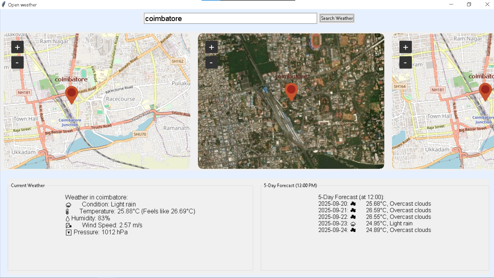

# ☁️ OPEN WEATHER


#### Allows Users to Load a Weather Information About The Location Usin The Search Box And Enter The Location

🖼️ Preview 




## Core Features
  #### ☀ Tkinter GUI 
  #### ❄ Tkinter Map View
  #### ⛄ Open_Weather_API
  #### 🌧 City Weather Search
  #### 🌦 5 Day Forecast
  #### 🌡 weather Descriptions With Emojis
  #### ☔ Current Weather
  ---

  ## 🛠️ installation
  Clone The Repo
  ```
  git clone https://github.com/Swethancyber/open_weather.git
  ```


   ``` python pip 
   pip install requests       
   pip install TkinterMapView
   ```

  ---
  ## 🤝 Contrubution 
  Share Your Creativity Here
  
  - #### Foke repo

  - #### Add your Creavatiey

  - ### Send Pull Request


   
# Open_weathe.exe will uplode later
